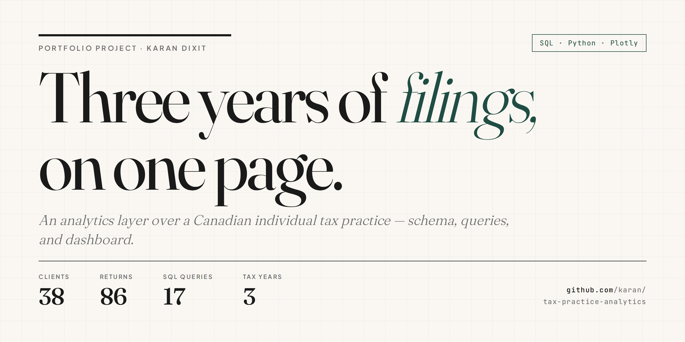

# Tax Practice Analytics

> Three years, 38 clients, 86 returns — what the data says about a working Canadian tax practice.

[](LICENSE)


**🔗 Live dashboard:** [https://karanhshah2005-lgtm.github.io/tax-practice-analytics/](https://karanhshah2005-lgtm.github.io/tax-practice-analytics/)

---

I run a freelance individual tax preparation practice in Ottawa, Ontario. This project is a **fully synthetic** but realistically modeled analytics layer over that practice — the schema, queries, and dashboard a real practitioner would actually want for client trends, common deductions, pricing, and planning opportunities.

The data is fabricated. The questions are not.



---

## Quick start

```bash
make build      # generates the database, runs queries, builds the dashboard
make serve      # opens it on http://localhost:8000
```

Or step by step, no Make required:

```bash
python3 generate_data.py    # creates tax_practice.db
python3 run_analysis.py     # runs queries → results.json + dashboard.html + index.html
open index.html             # any browser, no build step
```

No dependencies beyond the Python standard library. Plotly loads from CDN inside the dashboard.

---

## What's in here

| File | What it does |
|---|---|
| `schema.sql` | Relational schema — 5 tables (`clients`, `tax_returns`, `income_items`, `deductions`, `credits`), 12 indexes, FKs |
| `generate_data.py` | Generates 38 synthetic clients × 3 tax years with calibrated distributions for income, deductions, credits, and prep complexity. Seeded for reproducibility. |
| `queries.sql` | 17 named analytical queries — CTEs, window functions (`LAG`, `NTILE`), cohort retention, percentile bucketing, missed-opportunity flags |
| `run_analysis.py` | Parses `queries.sql`, executes each named block, exports `results.json`, bakes data into `dashboard.html` + `index.html` |
| `dashboard_template.html` | The dashboard source — Plotly via CDN, Fraunces serif, custom palette |
| `index.html` / `dashboard.html` | Rendered standalone dashboard (identical content; `index.html` is what GitHub Pages serves) |
| `tax_practice.db` | SQLite database (committed for reproducibility — clone and query immediately) |
| `results.json` | All query results in JSON |
| `preview.png` | Social card / OG image — what shows up when the link is shared |
| `Makefile` | One-command builds and local serving |

## Schema (ERD in words)

```
clients (38 rows)
  └── tax_returns (86 rows, 1 per client-year)
        ├── income_items   (T4, T4A, T5, T3, T2125, Rental, CapitalGains, …)
        ├── deductions     (RRSP, ChildCare, BusinessExpenses, UnionDues, …)
        └── credits        (BasicPersonal, Charitable, CCB, GST/HST, …)
```

Every income slip, deduction, and credit is a separate row — so the data supports both rolled-up summaries and line-level analysis without re-shaping.

---

## What the queries answer

These are the questions a BA/DA — or a tax practitioner with ten extra minutes — should be asking:

**Practice performance**
- How fast is the book of clients growing year over year, and is that growth driven by clients or by fee inflation?
- What's our cohort retention curve — are clients from 2022 still filing with us in 2024?
- Which acquisition channels produce the most valuable clients (revenue per client, not just headcount)?

**Client mix**
- How is income distributed across the book (P25 / median / P75 / mean), and is the spread widening?
- What's the share of clients filing self-employment income (T2125), and is the gig-economy tail growing?
- What's the geographic and demographic profile?

**Where the money goes**
- Which deductions are most claimed (by frequency) versus most material (by total dollars)?
- Same question for credits — split refundable from non-refundable, because that distinction matters for planning conversations.
- Which income slip types are most common, and what's the average dollar amount per slip?

**Operations**
- How does prep fee scale with complexity, and is the effective hourly rate consistent across tiers?
- Who files late, and is it concentrated in any occupation segment?

**Planning leads (the punchline)**
- Which clients have material RRSP contribution headroom — high income, near-zero contribution — and what's the implied tax savings?
- Who's consistently owing large balances? (Candidates for installment planning.)

The last two queries turn the practice into a **lead list for proactive client outreach** — not a thing most preparers actually do, and exactly the kind of thinking a BA/DA interviewer wants to see.

---

## Sample queries

**Year-over-year growth with `LAG()`:**
```sql
WITH yearly AS (
  SELECT tax_year, COUNT(DISTINCT client_id) AS clients_served,
         SUM(prep_fee) AS revenue
  FROM tax_returns GROUP BY tax_year
)
SELECT tax_year, clients_served, revenue,
       ROUND(100.0 * (revenue - LAG(revenue) OVER (ORDER BY tax_year))
                  / LAG(revenue) OVER (ORDER BY tax_year), 1) AS revenue_growth_pct
FROM yearly ORDER BY tax_year;
```

**Cohort retention (acquisition year × filing year matrix):**
```sql
WITH cohort_returns AS (
  SELECT c.client_since_year AS cohort, r.tax_year,
         COUNT(DISTINCT r.client_id) AS active_clients
  FROM clients c JOIN tax_returns r USING (client_id)
  GROUP BY c.client_since_year, r.tax_year
), cohort_size AS (
  SELECT client_since_year AS cohort, COUNT(*) AS cohort_size
  FROM clients GROUP BY client_since_year
)
SELECT cr.cohort, cr.tax_year, cr.active_clients,
       ROUND(100.0 * cr.active_clients / cs.cohort_size, 1) AS retention_pct
FROM cohort_returns cr JOIN cohort_size cs USING (cohort)
ORDER BY cr.cohort, cr.tax_year;
```

**Missed RRSP opportunity (planning lead generator):**
```sql
WITH rrsp_contribs AS (
  SELECT return_id, SUM(amount) AS rrsp_amount
  FROM deductions WHERE deduction_type = 'RRSP'
  GROUP BY return_id
)
SELECT r.client_id, r.tax_year, r.total_income,
       COALESCE(rc.rrsp_amount, 0) AS rrsp_contributed,
       ROUND(MIN(r.total_income * 0.10, 31560)
             * (CASE WHEN r.total_income > 111733 THEN 0.43
                     WHEN r.total_income >  55867 THEN 0.30
                     ELSE 0.20 END), 0) AS potential_savings_at_10pct
FROM tax_returns r
LEFT JOIN rrsp_contribs rc USING (return_id)
JOIN clients c USING (client_id)
WHERE r.total_income > 70000
  AND COALESCE(rc.rrsp_amount, 0) < 1000
  AND c.occupation_category != 'retired'
  AND r.tax_year = (SELECT MAX(tax_year) FROM tax_returns)
ORDER BY potential_savings_at_10pct DESC;
```

---

## Deploy your own (GitHub Pages)

After cloning or creating the repo:

1. Push to GitHub. The repo must be public on the free Pages tier.
2. In the repo: **Settings → Pages → Source: Deploy from a branch → `main` / root → Save**.
3. Wait ~30 seconds. Your dashboard is live at `https://<your-username>.github.io/tax-practice-analytics/`.
4. (Optional) Replace `karanhshah2005-lgtm` placeholders in `dashboard_template.html` with your handle so LinkedIn link previews resolve, then `make build && git push`.

---

## Skills demonstrated

- **SQL**: schema design, foreign keys, indexes, CTEs, window functions (`LAG`, `NTILE`), aggregation, conditional aggregation, multi-table joins
- **Data modeling**: normalized line-item tables that support both summary and granular analysis
- **Python**: synthetic data generation with calibrated distributions, SQLite scripting, query orchestration
- **Data visualization**: interactive Plotly dashboard with consistent visual language (KPI grid, cohort heatmap, dual-axis charts, inline bar tables, tabular detail panels)
- **Domain knowledge**: Canadian individual taxation — slip types (T1, T4, T2125, T5, T3, T4A(P/OAS), T4E), federal/provincial bracket math, common deductions and credits, refundable vs non-refundable, marginal rates
- **Business framing**: turning summary stats into operational decisions (pricing tiers, deadline workflows, client outreach lists)
- **Build/deploy**: GitHub Pages, OG/Twitter card meta for shareable links, Makefile for reproducible builds

---

## Privacy note

**Every client identifier, income figure, deduction, and credit in this dataset is fabricated.** The data is generated procedurally with seeded randomness from `generate_data.py` to model the *distribution* of a real Canadian tax practice without exposing any actual client information. The schema, queries, and dashboard logic are production-quality; only the data is synthetic.

---

## License

[MIT](LICENSE). Take what's useful.
